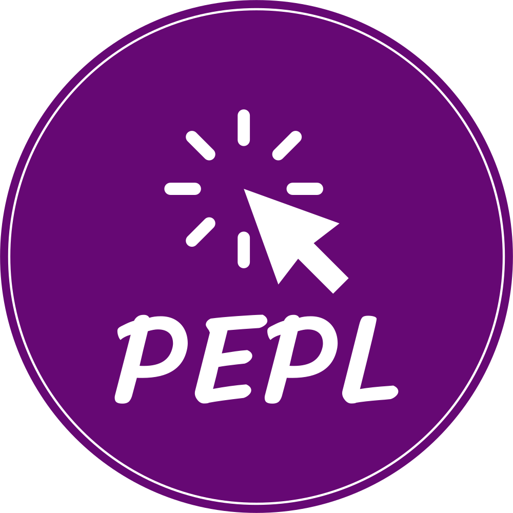

[English](/README.md) | [简体中文](/README.zh_CN.md)

<p align="center">
  <a href="" rel="noopener">
 </a>
</p>
<h2 align="center"><i>Part-of-speech Enhanced Prompt Learning</i>  for clickbait detection</h2>

<div align="center">

  [](/LICENSE)
  
  [](https://www.python.org/downloads/release/python-3108/)
  [](https://pytorch.org/get-started/previous-versions/#v1130)
  


</div>

---


## 📝 Table of Contents
- [About](#about)
- [Getting Started](#getting_started)
- [Usage](#usage)
- [Authors](#authors)
- [Contributing](#contributing)

## 🧐 About <a name = "about"></a>
This project implements a detection method for Chinese clickbait (标题党) news, which can determine whether the  Chinese text belongs to the clickbait or not. Examples of clickbait and non-clickbait news are shown below:

|  Example   | Label  |
|  ----  | ----  |
| 当女生问“你在干啥”，这句回答100%勾起她的兴趣 <br/>When a girl asks "what are you doing", this answer is 100% to arouse her interest. | clickbait |
| 北京发布做好复工复产疫情防控常态化工作通告 <br/>Beijing government issued the Notice on Normalized Covid-19 Prevention and Control Measures for Resumption of Work.  | non-clickbait |

The main idea is in the research paper *Detecting Clickbait in Chinese Social Media by Prompt Learning*, which is accepted for publication in CSCWD'23.

## 🏁 Getting Started <a name = "getting_started"></a>
The project needs prepared work first before it can be used.

### Prerequisites
The dependency frameworks of this project are as follows:

- [Pytorch](https://pytorch.org/) - Deep Learning framework, please refer to the [guide](https://pytorch.org/get-started/previous-versions/#v1130) for installation, the version is 1.13.0
- [LTP](https://github.com/HIT-SCIR/ltp) - Chinese NLP tools, please refer to the [guide](https://github.com/HIT-SCIR/ltp) for installation, the version is 4.2.11
- [Transformers](https://github.com/huggingface/transformers) - Pretrained Language Model framework, please refer to the [guide](https://huggingface.co/docs/transformers/installation) for installation, the version is 4.24.0
- [OpenPrompt](https://github.com/thunlp/OpenPrompt) - Prompt Learning framework, please refer to the [guide](https://github.com/thunlp/OpenPrompt#installation) for installation, the version is 1.0.1

In addition, there are other dependency packages that need to be installed. If your python version is 3.10.8, you can install them directly by executing the following command:

```
pip install -r requirements.txt
```

If you are using another python version, please modify the requirements.txt to make it compatible.


### Dataset
For this project, the [WCD](https://github.com/natsusaikou/WeChat-Clickbait) dataset is for training and testing, please download the [all_labeled.csv](https://github.com/natsusaikou/WeChat-Clickbait/blob/master/data/all_labeled.csv) file and copy it in the **/data** path. If you must change the dataset store location, please modify the *DatasetPath* variable in the **main.py** file.


## 🎈 Usage <a name="usage"></a>
### Train

After completing the preparations, the following command can be used for training:

```
python main.py -s 0.01 0.5
```

The meaning of the two parameters for -s is using 1% of the dataset as the training set and 50% of the dataset as the test set.

The following command can be used to train models in extremely few-shot scenarios:

````
python main.py -f 16
````

The meaning of the parameter for -f is that only 16 clickbait and 16 non-clickbait samples are used for training.

In addition, the command supports other settings, as follows:

- -bs: set training batch size
- -lr: set training learning rate
- -ep: set training epoch
- -m: set mode，only support *pepl* and *base*，where *pepl* is our method，and *base* is the baseline
- -plm: set the PLM architecture，support *bert*、*roberta*、*ernie*、*Erlangshen*

An example of a completely set training command is as follows:

```
python main.py -s 0.01 0.5 -bs 8 -lr 5e-5 -ep 3 -m pepl -plm bert
```

### Predict

After the training, models will be stored in the **/checkpoints** folder. The input can be predicted by executing the following command, where the **items.txt** and **news.txt** files in the **/data** folder are samples to be predicted.

```
python use.py -p .\checkpoints\base_bert_fc_2.pt -m base -plm bert
```

The meanings of the parameters are shown below:

- -p: set models store location，such as the base_bert_fc_2.pt 
- -m: set mode，only support *pepl* and *base*
- -plm: set the PLM architecture，support *bert*、*roberta*、*ernie*、*Erlangshen*

**Note: -m and -plm should be the same as the settings used in training phase**


## ✍️ Authors <a name = "authors"></a>
- [@WeSeewy](https://github.com/WeSeewy) - Idea & Develop
- [@caomingpei](https://github.com/caomingpei) - Test & Doc

See also the list of [contributors](https://github.com/WeSeewy/Chinese-Clickbait/contributors) who participated in this project.

## ⛏️ Contributing <a name = "contributing"></a>
If you find problem(s) in this repo, please make issues.

If you want to contribute to this repo, please fork and create a new pull request.

The commit style should follow the convention: 

```
[!TYPE:] message
```

The [!TYPE:] includes the following types:

- !F: create new function
- !B: bug fix
- !D: update about the documents
- !S: change code style
- !R: refactor the code
- !O: optimize the performance
- !T: add test
- !C: chores of update the dependency
- !A: archive the related files

Example: 

```
!D: configuring the git style
```

This example means this commit [!D:] is about update a document and the commit reason is configuring the git style.
